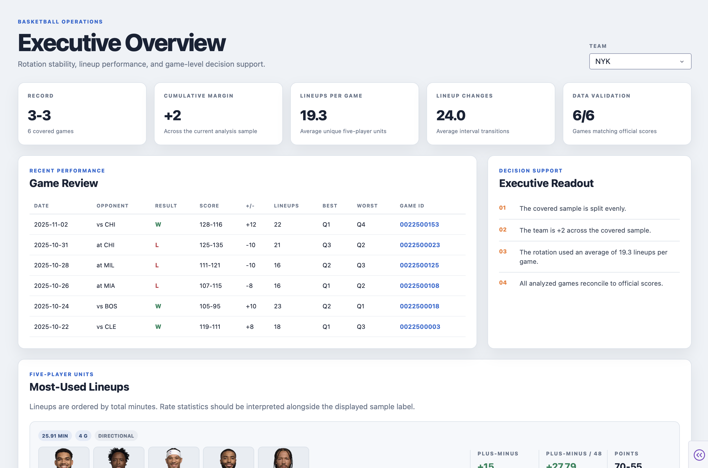
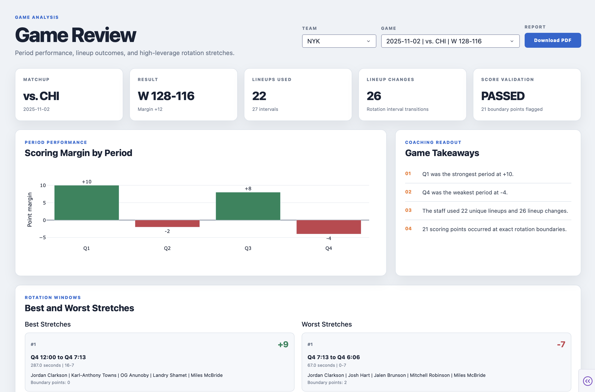
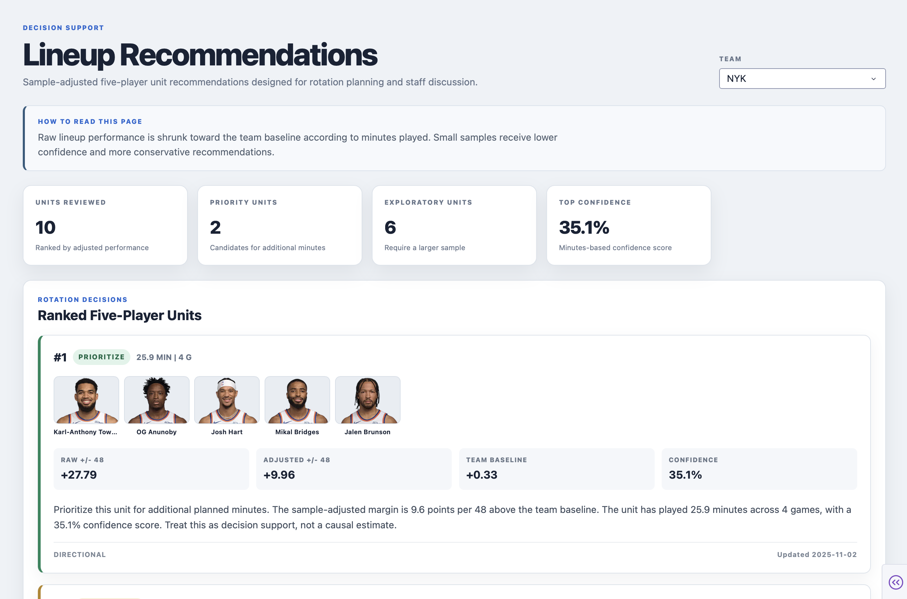
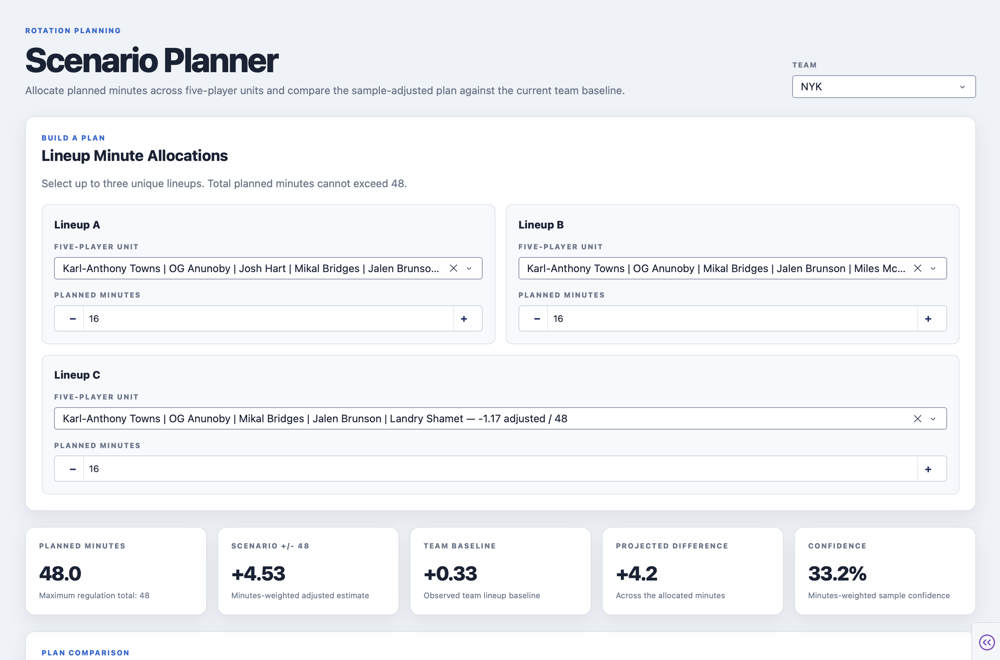
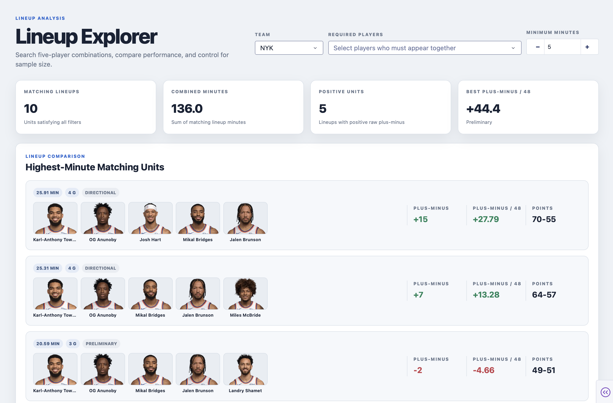
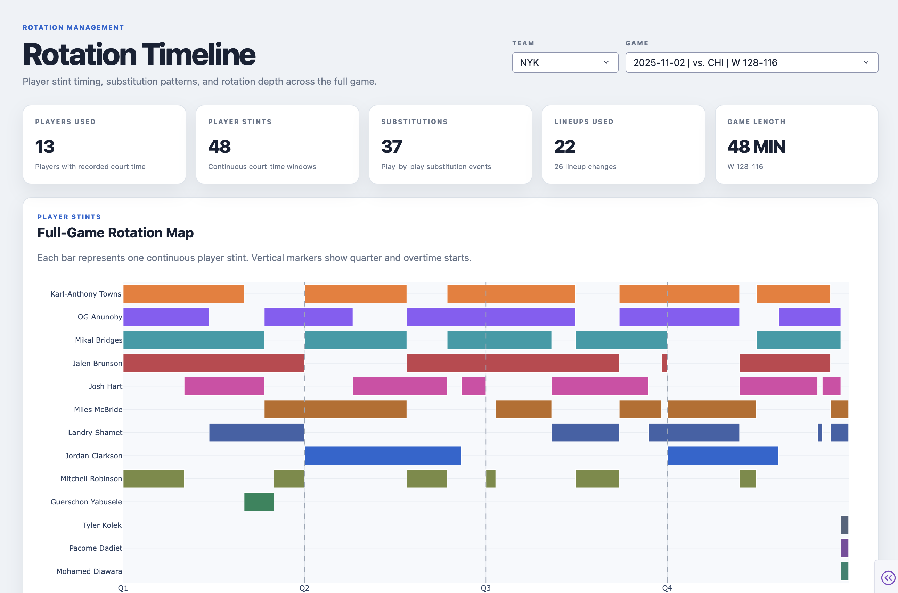
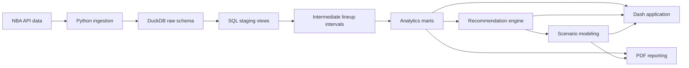

# NBA Rotation Lab
[](https://github.com/glederer04/NBA_Samples/actions/workflows/rotation-lab-quality.yml)

An end-to-end NBA lineup and rotation decision-support system built with Python, DuckDB, SQL, Dash, Plotly, and ReportLab.

[Open the live NBA Rotation Lab](https://glederer-nba-rotation-lab.onrender.com)

NBA Rotation Lab converts rotation stints, play-by-play events, game results, and player box scores into coach-facing lineup analysis, game reports, sample-adjusted recommendations, and interactive rotation scenarios.

## Project Objective

Basketball operations staff need more than a leaderboard of raw plus-minus results. They need to understand:

- Which five-player units are receiving meaningful minutes?
- Which results are supported by a usable sample?
- When did a game’s strongest and weakest rotation stretches occur?
- How does a proposed rotation plan compare with the team baseline?
- How much confidence should a staff place in each conclusion?

This project demonstrates the complete analytics workflow required to answer those questions:

1. NBA data ingestion
2. Relational data modeling
3. SQL transformation layers
4. Lineup interval reconstruction
5. Sample-size adjustment
6. Interactive decision-support tools
7. Professional PDF reporting
8. Automated testing and validation

## Application Pages

### Executive Overview

Summarizes team record, cumulative margin, lineup usage, rotation changes, data validation, recent games, and most-used units.



### Game Review

Provides period scoring margins, game takeaways, best and worst rotation stretches, five-player lineup results, and downloadable PDF reports.



### Recommendations

Ranks five-player units using a sample-adjusted estimate rather than raw plus-minus alone.

Recommendation labels include:

- **Prioritize** — adjusted performance meaningfully exceeds the team baseline.
- **Monitor** — results are near the baseline and should remain under evaluation.
- **Limit** — adjusted performance trails the baseline.
- **Exploratory** — the sample is too small for a stronger recommendation.



### Scenario Planner

Allows staff to allocate up to 48 planned minutes across selected lineups and compare the resulting scenario with the current team baseline.

Outputs include:

- Planned lineup minutes
- Sample-adjusted scenario margin
- Team baseline
- Projected difference
- Minutes-weighted confidence
- Visual plan comparison
- Staff-facing interpretation
- Downloadable two-page rotation-scenario PDF



### Lineup Explorer

Filters five-player units by team, required players, and minimum minutes. Players and lineups are ordered by tracked minutes to keep the most relevant options visible first.



### Rotation Timeline

Displays player stints, substitution events, lineup changes, and rotation timing for individual games.



## Technical Architecture



## SQL Data Model

The database uses layered schemas:

| Layer | Purpose |
|---|---|
| `raw` | Games, teams, players, box scores, rotations, and play-by-play |
| `staging` | Cleaned events and game context |
| `intermediate` | Reconstructed lineup intervals and scoring attribution |
| `marts` | Coverage, rotation profiles, lineup performance, game review, and recommendations |

SQL transformations are stored under `sql/` and executed in dependency order.

## Recommendation Methodology

Raw lineup plus-minus can be misleading when a unit has played only a few minutes.

The recommendation mart shrinks each lineup’s plus-minus per 48 toward its team baseline:

```text
confidence weight = lineup minutes / (lineup minutes + 48)

adjusted +/- 48 =
    confidence weight × raw lineup +/- 48
    + (1 - confidence weight) × team baseline
```

This produces conservative estimates for small samples while allowing established units to retain more of their observed performance.

The recommendations are descriptive decision support. They are not causal estimates and do not account for every contextual variable, including opponent quality, player availability, or matchup assignment.

## Scenario Methodology

The Scenario Planner weights each selected lineup’s adjusted performance by its planned minutes.

```text
scenario +/- 48 =
    sum(adjusted lineup +/- 48 × planned minutes)
    / total planned minutes
```

The scenario is compared with the team baseline over the same planned-minute window.

## Technology Stack

- Python 3.11
- DuckDB
- SQL
- pandas
- NumPy
- nba_api
- Dash
- Plotly
- ReportLab
- pytest
- Ruff
- Docker and VS Code Dev Containers

## Project Structure

```text
nba_rotation_lab/
├── assets/                 # Dashboard CSS and fallback imagery
├── data/                   # Local DuckDB database and source data
├── pages/                  # Dash application pages
├── reports/                # Report-related project resources
├── scripts/                # Ingestion, inspection, and reporting commands
├── sql/
│   ├── 00_setup/
│   ├── 01_raw/
│   ├── 02_staging/
│   ├── 03_intermediate/
│   └── 04_marts/
├── src/rotation_lab/
│   ├── dashboard/
│   ├── ingest/
│   ├── modeling/
│   ├── recommendations/
│   └── reporting/
└── tests/
```

## Data and Usage Note

NBA Rotation Lab is an independent analytics portfolio project. NBA names and imagery belong to their respective rights holders.

The included data represents a development sample and should not be treated as a complete production dataset or an official team evaluation.

## Potential Extensions

- Opponent-strength and schedule adjustment
- Player-availability scenario controls
- Possession-based lineup efficiency
- Matchup-specific lineup recommendations
- Automated daily data refresh
- Production deployment and authentication

## Local development and quality review

From this directory, create a Python 3.11–3.13 environment, install with `python -m pip install -e '.[dev]'`, then run `python app.py` and open `http://localhost:8050`.

For a fresh checkout, use the included sample database with `ROTATION_LAB_DATABASE_PATH=data/demo/rotation_lab.duckdb python app.py`. Run `python -m pytest` and `ruff check .` for validation.

The [September 2026 quality review](docs/quality-review-2026-09.md) documents responsive layout fixes, bundled team logos, query caching, rotation-chart optimization, and improved PDF generation. Game PDFs include every qualifying stretch returned by the existing query and can span more than two pages; scenario reports retain their two-page design.

The [follow-up review](docs/quality-review-followup-2026-09.md) covers normalized dropdown logos, browser-native PDF downloads and previews, compact lineup names, corrected numeric filtering, reordered navigation, verification timings, and suggested next improvements.
